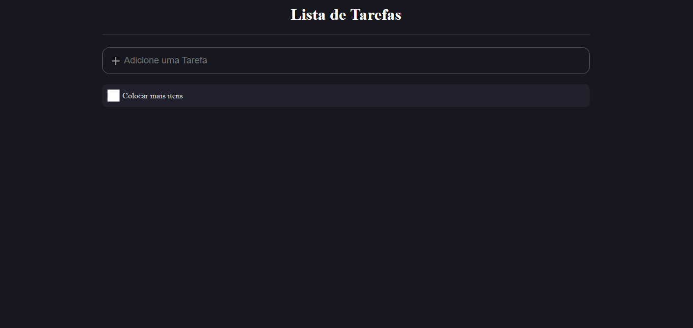

# :books: Primeiro Projeto Desafio 5em5 (React) :books: :

Estou acompanhando a saga de 5 projetos React propostos pela B7Web.
O primeiro é um projeto To-Do, um projeto simples que serve para apresentar os conceitos básicos do React.

## Libs:

* Styled-components
* React
* Typescript

## Algumas Descrições:

* Não segui o padrão proposto pelo professor, neste caso fiz a divisão padrão que faço nos meus projetos. Fiz componentes para cada região de contato do usuário e os agrupei em Home.tsx.

* AddArea.tsx é o componente responsavél por capturar a nova tarefa do usúario e colocar na lista de to-dos.

* ItemList.tsx é o componente que faz a organização dos itens.

* handleKeyUp é utilizada no AddArea.tsx para enviar a nova tarefa para a lista de tarefas que fica no Home.tsx.

